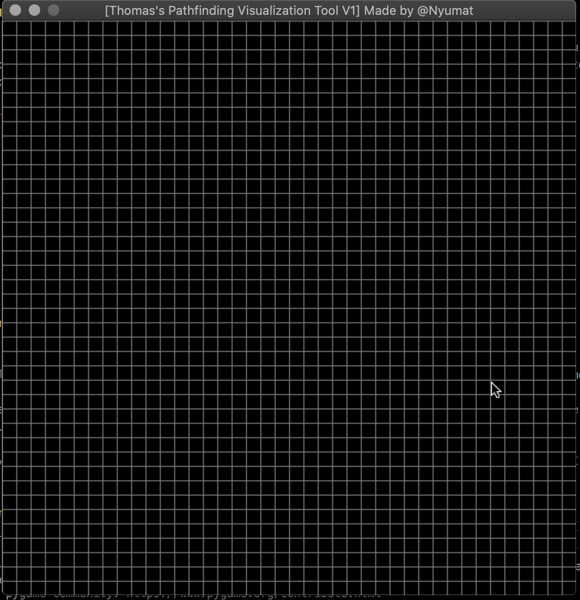
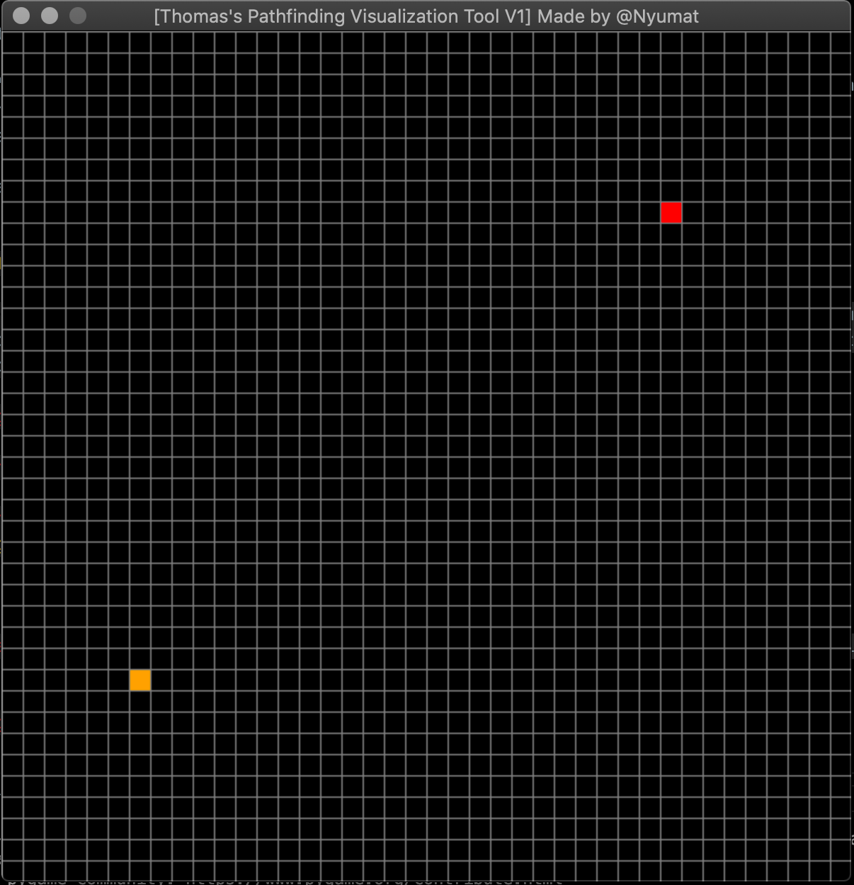
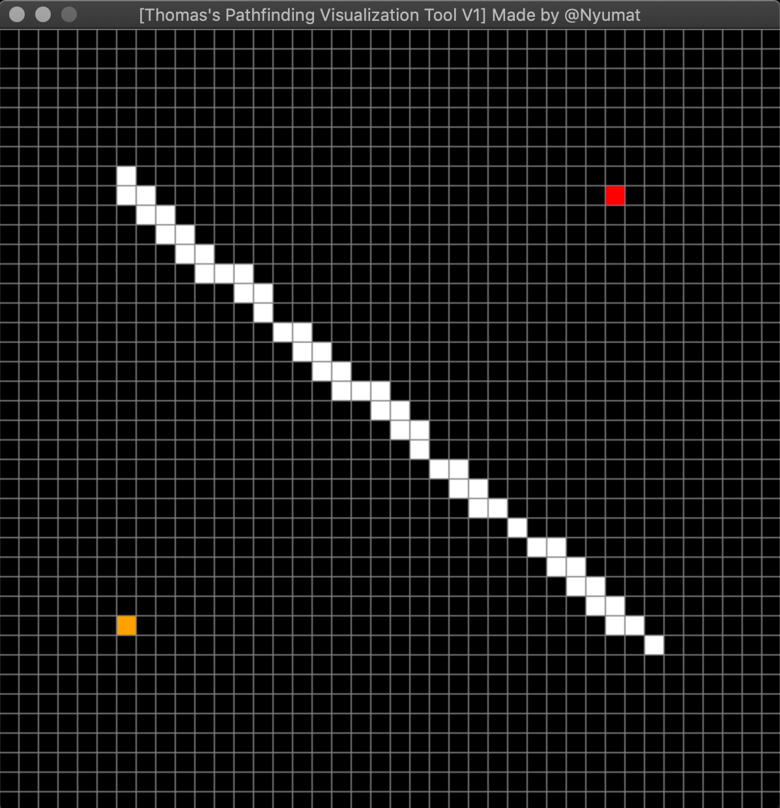
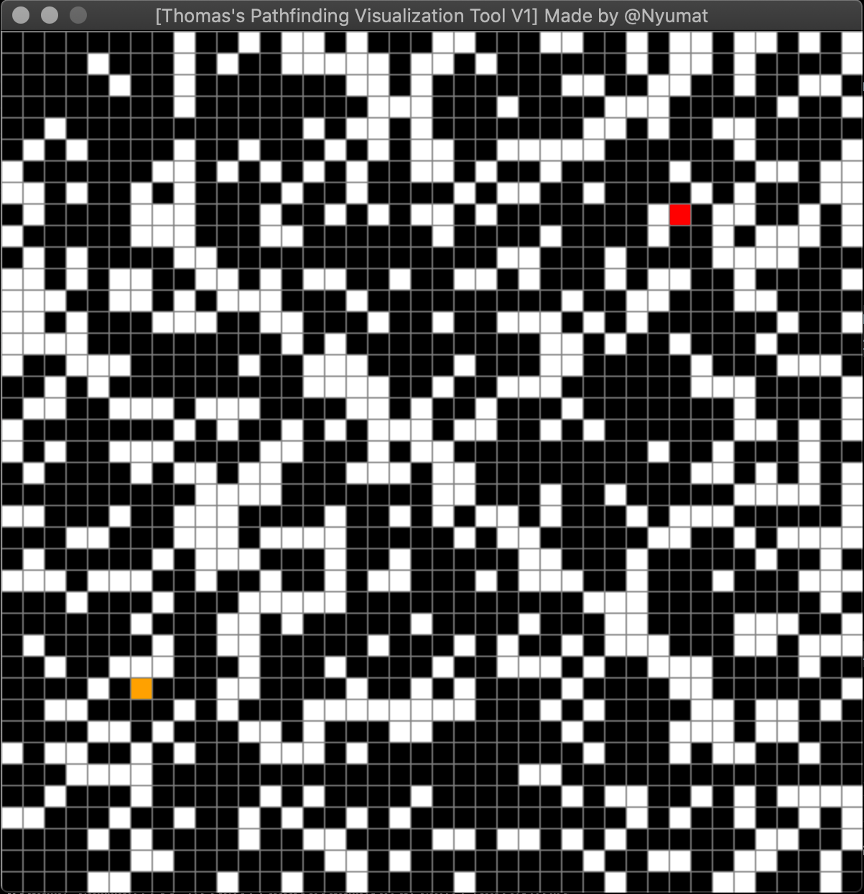
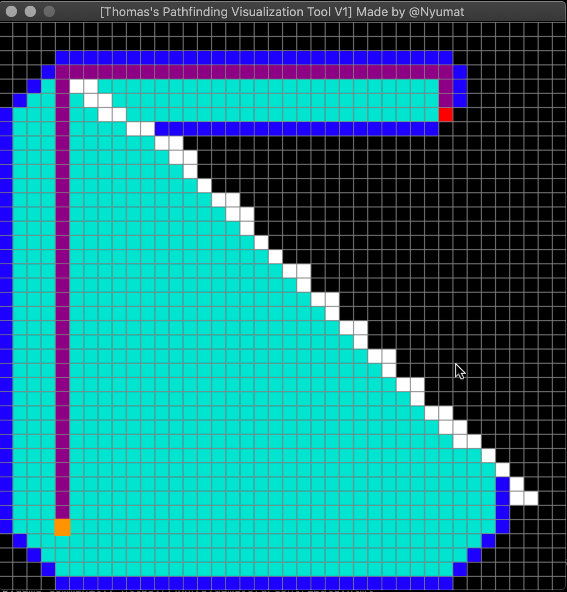
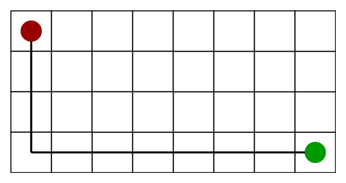

<h1 align="center" style="font-size: 3rem;">A* Pathfinding Visualization Tool</h1>

<b><p align="center">Made by @Nyumat</p></b> 

 <b><p align="center">This tool is an interactive, easy to use visualization of the popular A\* search algorithm.</p></b>
 
 <p align="center">The tool itself uses the game-building python module pygame's OOP concepts to create neighbors/barriers along with an A* search algorithm priority queue implementation to traverse the canvas until the optimal path from start node to the end node is met.</p>


<h1 align="center" style="font-size:3rem;"> Usage </h1>

<b><p align="center">[Built for compatibility with Mac, Linux, and Windows Devices]</p></b>

<h1 align="center"> Step 1: Launch </h1>

<p align="center">When you first run the file, you should see this:</p>

<p align="center">
    
</p>

<b>
    <p align="center"> This is the grid canvas. Keyboard key 'r' will bring you back to this state<p>
</b>

<h1 align="center"> Step 2: Placing Nodes </h1>


<p align="center"> 
    
</p>

<b>
    <p align="center"> To place the 2 Nodes as seen above, 'left click' on your mouse or trackpad.<p>
</b>

<h1 align="center"> Step 3: Placing Barriers</h1>

<p align="center"> 
    
</p>

<p align="center"> Barriers can also be placed with a left click. Unlike nodes, there can be an unlimited number of barriers.</p>

<p align="center">
    
</p>

<b>
    <p align="center"> <b>Woah!</b> <i>Barrier layout can be simple, or very complex...</i> if it gets too complex and you'd like to delete a barrier or node, a 'right click' will do just that for you.</p>
</b>

<h1 align="center"> Initializing a Search </h1>

<p align="center">
    
</p>

<p align="center">To start the search, just tap 'spacebar' and the algorithm will be underway. </p>
<p align="center"> Once it's done, you can readjust the canvas with the commands I previously mentioned or press spacebar again to execute the search again.</p>

 ## Features 

 - Two placeable Nodes
 - Colorful GUI
 - Blank Dark Grid Canvas
 - Unlimited placeable Barriers
 - One Tap execution with Pygame
 - Re-Searching
 - Canvas Clearage
 - An Eraser
 
 ## The Algorithm

__*The A\* Search Algorithm is a path search and graph traversal algorithm.* It is really efficent, and has simple, easy to understand implementation for newbies__

The algorithm works by traversing the lowest-cost tree from the starting "node" to the target node. Because we're working with a grid and can only move in 4 directions, the **Manhattan Distance Heursitic** is the method I used for computing and visualizing the algorithm. 

<i><p align="center">The Heuristic looks like this:</p></i>

<p align="center"> 
  
 </p>

As you can see, this search example took a path that was only within the constrains of non-diagonal grid movement. The search's goal is to find paths that are combination of straight line movements. 

Calculating the movement cost that it would take to go from the beginning node to the end node was done by obtaining the sum of absolute values of differences in the first node's x and y coordinates and the ending node's x and y coordinates.

**If we wanted to visualize this calculation with psuedocode it would look like this:**

```
movement_cost = abs (current_node.x – goal.x) + abs (current_node.y – goal.y) 
```
Once we're able to compute that cost and evaluate each neighbor of the initially place node, for each non-neighbor we select the path with the lowest f cost and continue this loop until we get to the ending node.

*And that's how the algorithm works.*

## Other Random Stuff

For the technical nerds:
>The only drawback of the A* algorithm versus any of the other greedy algorithms is the memory hit. 

>This is pretty true for pretty much all BFS algorithms but the bar is so low that it should always capable of being executed on current machines.

- This was my first real Data Structure and Algorithms side project outside of leetcode. I struggled for countless hours trying to compute the logic for the algorithm, but nonetheless I've learned so much and it's honestly made me realize just how much I still have to learn. :smile:

## To-Do's

- [ ] Add elapsed time on spacebar event
- [ ] Integrate a stack for infinite nodes
- [ ] Change the priority queue instance to a smaller value
- [ ] Add a GUI color selector prompt on each run of .exe
- [ ] Implement a stop search feature 

## License

[MIT License](LICENSE.txt)
